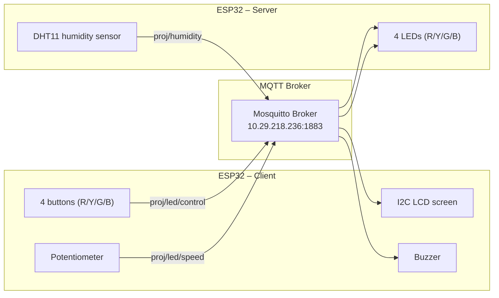

# 🌡️ ESP32 WiFi/MQTT – Smart Humidity & LED Control System

A project for the **Embedded Systems** course 

A system built around two ESP32 boards communicating over **WiFi** using the **MQTT** protocol. One board (**Server**) reads humidity from a DHT11 sensor and controls LEDs and a buzzer, while the other board (**Client**) displays the data on an LCD screen and sends commands via buttons and a potentiometer.

---

## 📐 System Architecture



Data flow:
1. The **Server** reads humidity from the DHT11 every 3 seconds and publishes it to the `proj/humidity` topic.
2. The **Client** subscribes to that topic, displays the humidity on its LCD, and automatically turns on a buzzer if the humidity crosses a configured threshold.
3. Pressing one of the 4 buttons on the Client sends a toggle command (start/stop blinking) to the `proj/led/control` topic, and the Server starts/stops blinking the corresponding LED.
4. Turning the potentiometer on the Client sends a blink speed level (0–4) to the `proj/led/speed` topic, and the Server updates the blink rate accordingly.

---

## ✅ Assignment Requirements Coverage

| Requirement | Implementation |
|---|---|
| Measure humidity on the Server side and display it on the Client side | DHT11 sensor + MQTT topic `proj/humidity` + LCD display |
| Control the blinking LED's color from the client | 4 independent buttons (red/yellow/green/blue), each with its own toggle |
| Control LED blink timing via a POT, split into 5 levels | ADC value mapped with `map()` into 5 levels (0–4); `speedTable` on the server side |
| Trigger a buzzer when humidity crosses a threshold | `HUMIDITY_THRESHOLD = 60.0%` defined in the Client code, adjustable |
| Communication protocol: WiFi + MQTT | `WiFi.h` + `PubSubClient` on both sides |
| Advanced components: buzzer and DHT11 sensor | Fully implemented, with explanatory comments in the code |

---

## 🧰 Hardware Components (BOM)

| Component | Qty | Notes |
|---|---|---|
| ESP32 Dev Board | 2 | One as Server, one as Client |
| DHT11 humidity sensor | 1 | On the Server side |
| 16x2 LCD with I2C module (PCF8574) | 1 | On the Client side, address 0x27 (or 0x3F) |
| LEDs (red, yellow, green, blue) | 4 | On the Server side |
| 220Ω resistors | 4 | LED current-limiting |
| Push buttons | 4 | On the Client side |
| Potentiometer | 1 | On the Client side |
| Buzzer (passive/active) | 1 | On the Client side |
| WiFi router (2.4GHz) | 1 | Shared by both boards and the broker machine |
| Computer running an MQTT Broker (Mosquitto) | 1 | Can also be a Raspberry Pi |

---

## 🔌 Hardware Wiring (Pinout)

### 🖥️ Client ESP32

| Component | ESP32 Pin | Notes |
|---|---|---|
| SW1 – Red | GPIO 32 | `INPUT_PULLUP`, pressed = LOW |
| SW2 – Yellow | GPIO 33 | `INPUT_PULLUP` |
| SW3 – Green | GPIO 25 | `INPUT_PULLUP` |
| SW4 – Blue | GPIO 26 | `INPUT_PULLUP` |
| Potentiometer | GPIO 34 | Analog input only (ADC1) |
| Buzzer | GPIO 13 | Digital output |
| LCD SDA | GPIO 21 | I2C |
| LCD SCL | GPIO 22 | I2C |

### 🖥️ Server ESP32

| Component | ESP32 Pin | Notes |
|---|---|---|
| DHT11 (Data) | GPIO 4 | Requires a ~10kΩ pull-up resistor if not built into the module |
| Red LED | GPIO 25 | |
| Yellow LED | GPIO 14 | |
| Green LED | GPIO 26 | |
| Blue LED | GPIO 27 | |

> 💡 If the LEDs behave inverted (light up when they should be off), set `LED_ACTIVE_HIGH` to `false` in `Project_Server_ESP32.ino`.
> 💡 If the screen shows garbled characters, try changing the I2C address from `0x27` to `0x3F` in `Project_Client_ESP32.ino`.

---

## 📡 Communication Protocol – MQTT Topics

| Topic | Direction | Payload | Description |
|---|---|---|---|
| `proj/humidity` | Server → Client | Numeric string, e.g. `"55.0"` | Humidity value in %, published every 3 seconds |
| `proj/led/control` | Client → Server | Single char: `r`/`y`/`g`/`b` | Toggles blinking for the corresponding LED |
| `proj/led/speed` | Client → Server | Single char: `0`–`4` | Blink speed level (0 = slow, 4 = fast) |

Actual blink speed table (server code):

| Level | Toggle interval (ms) |
|---|---|
| 0 | 1000 |
| 1 | 700 |
| 2 | 500 (default) |
| 3 | 300 |
| 4 | 120 |

---

## 💻 Software Requirements

- **Arduino IDE** (1.8.x or newer) or **PlatformIO**
- ESP32 board support for Arduino IDE (`esp32` by Espressif Systems, via Boards Manager)
- Libraries (install via Library Manager):
  - [`PubSubClient`](https://github.com/knolleary/pubsubclient) – MQTT communication
  - [`LiquidCrystal_I2C`](https://github.com/johnrickman/LiquidCrystal_I2C) – LCD screen (Client side only)
  - [`DHT sensor library`](https://github.com/adafruit/DHT-sensor-library) + `Adafruit Unified Sensor` (Server side only)
- A running **MQTT Broker** on the local network (e.g. [Mosquitto](https://mosquitto.org/))

---

## ⚙️ Setup & Running

### 1. Set up the MQTT Broker
Install Mosquitto on a computer or Raspberry Pi connected to the same WiFi network:
```bash
# Linux / Raspberry Pi
sudo apt install mosquitto mosquitto-clients
sudo systemctl enable --now mosquitto
```
Make sure port 1883 is open and the machine is reachable on the local network.

### 2. Configure connection details in the code
In both files (`Project_Client_ESP32.ino` and `Project_Server_ESP32.ino`), update:
```cpp
const char* ssid     = "YOUR_WIFI_SSID";
const char* password = "YOUR_WIFI_PASSWORD";
IPAddress mqtt_server(192, 168, 1, 100); // your Broker's IP address
```

> ⚠️ **Note:** the original files contain a real SSID, password, and IP address. Before pushing to a public GitHub repo, it's recommended to replace them with placeholders (as shown above) to avoid exposing your personal network details.

### 3. Uploading the code
1. Open `Project_Server_ESP32.ino` in Arduino IDE, select the correct board (`ESP32 Dev Module`), and upload it to the Server unit.
2. Open `Project_Client_ESP32.ino` the same way and upload it to the Client unit.
3. Open the Serial Monitor (115200 baud) on both boards to confirm successful WiFi and Broker connections.

---

## 🎮 How to Use

1. Once both boards boot up, the Client's LCD will show `WiFi connected` followed by `MQTT connected`.
2. Humidity is displayed automatically on the screen (`H: XX.X%`) along with a status (`LOW`/`OK`/`HIGH`).
3. Pressing any of the 4 buttons toggles blinking of the corresponding LED on the Server side.
4. Turning the potentiometer changes the blink rate of all active LEDs simultaneously (5 levels).
5. When humidity crosses the threshold (default 60%), the buzzer on the Client side turns on automatically, and switches off again once humidity drops back below the threshold.

The LCD also shows a status line:
```
H:55.0% OK
S:2 R1 Y0 G1 B0
```
(humidity + status on the first line; speed level and each LED's state on the second line)

---

## 🗂️ Code Structure

```
├── Project_Server_ESP32.ino   # DHT11 reading, LED control, humidity publishing
├── Project_Client_ESP32.ino   # LCD display, buttons, potentiometer, buzzer
└── README.md
```

Key design principles:
- **Software debouncing** for each button individually (50ms) to prevent double-triggering.
- **Non-blocking design** — no `delay()` calls inside the main `loop()`; all timing is based on `millis()`.
- **Clear separation of concerns**: the Server is responsible for sensing and hardware output, the Client is responsible for user input and display.

---

## 🛠️ Troubleshooting

| Issue | Possible fix |
|---|---|
| Screen shows garbled/box characters | Switch the I2C address between `0x27` and `0x3F` |
| LEDs light up inverted from expected | Set `LED_ACTIVE_HIGH` to `false` |
| `MQTT failed rc=-2` | Verify the Broker's IP address and port, and that the Broker machine is powered on and on the network |
| `MQTT failed rc=-4` | Connection timeout — check for a firewall or blocked port 1883 |
| DHT returns `nan` | Check wiring, add a 10kΩ pull-up resistor, verify `DHTTYPE` matches your actual sensor |
| No WiFi connection | Make sure the network is 2.4GHz (ESP32 does not support 5GHz) |

---

## 🚀 Possible Future Improvements

- Switch to secure MQTT (TLS) with username/password authentication for the Broker.
- Store WiFi/Broker credentials in a separate configuration file (e.g. `config.h`, excluded from Git) instead of hardcoding them in the source.
- Add historical humidity graphing (retained messages / a database).
- Add OTA (Over-The-Air) support for remote firmware updates.

